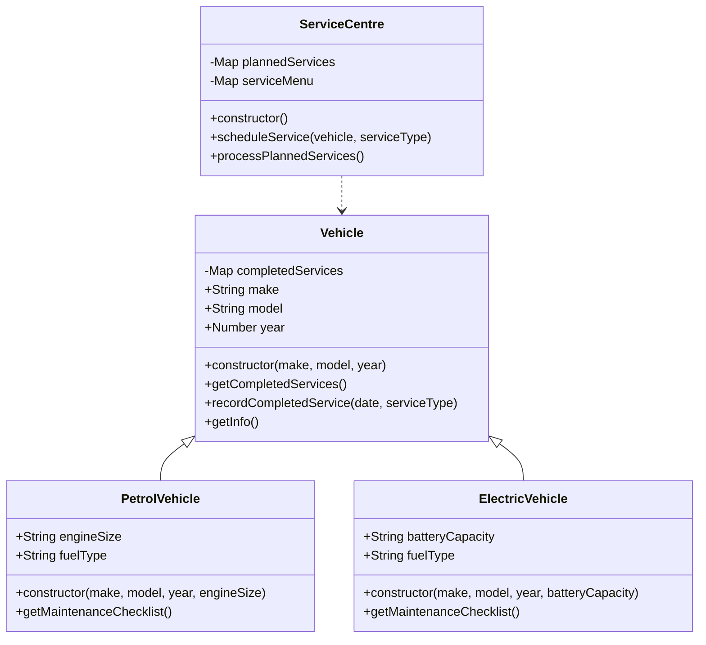

# Vehicle Service Management System

A JavaScript-based system for managing vehicle services, demonstrating object-oriented programming concepts including inheritance, encapsulation, and data structures.

## Project Structure

- [`index.js`](rag://rag_source_1): Main entry point that demonstrates the system's functionality
- [`vehicles.js`](rag://rag_source_2): Contains vehicle-related classes (Vehicle, PetrolVehicle, ElectricVehicle)
- [`serviceCentre.js`](rag://rag_source_5): Handles service scheduling and processing

## Key Features

- Vehicle class hierarchy with specific implementations for Petrol and Electric vehicles
- Service scheduling system with different service types (basic, full, diagnostic)
- Service history tracking for individual vehicles
- Maintenance checklists specific to vehicle types

## Class Diagram

## Learning Tasks
### 1. Add a HybridVehicle Class
* Create a new class that inherits from Vehicle
* Implement a specific maintenance checklist for hybrid vehicles
* Include both fuel and battery-related checks
### 2. Add Premium Service Type
* Extend the serviceMenu in ServiceCentre
* Add appropriate cost, duration, and description
* Ensure it can be scheduled like other service types
### 3. Service Cost Tracking
* Add functionality to calculate total service costs per vehicle
* Include both completed and planned services in the calculation
* Consider adding a method to view cost history
### 4. Service Completion System
* Implement a method to mark planned services as completed
* Move services from plannedServices to completedServices
* Add completion date and any relevant notes
### 5. Comprehensive Service History
* Create a method to view all services for a vehicle
* Include both planned and completed services
* Display in chronological order with status (planned/completed)
## Current Class Structure
* Vehicle: Base class with common vehicle properties
* PetrolVehicle: Specialised for petrol-based vehicles
* ElectricVehicle: Specialised for electric vehicles
* ServiceCentre: Manages service scheduling and processing
---

Each task builds upon the existing codebase and introduces new concepts while reinforcing OOP principles.